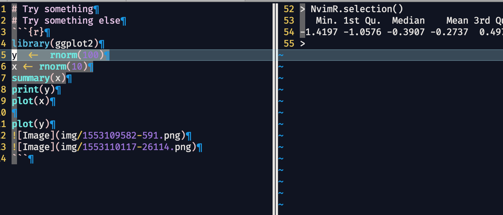

Be sure to check my post on medium for better reading experience and more screenshots ! 

[mediumLinkHere](https://medium.com/@xiaoouwang/how-to-turn-vim-into-a-perfect-better-r-ide-and-rmarkdown-writer-than-rstudio-part-i-48e1293c9c05)

The whole vimrc has been uploaded!

# perfectRVimConfiguration

I saw an article here (https://medium.freecodecamp.org/turning-vim-into-an-r-ide-cd9602e8c217, How to Turn Vim Into an IDE for R) giving a brief tutorial on R and vim integration. It’s very nice but some details are missing and some information outdated.

This article gives a configuration to turn vim into a full-fledged R IDE.

AND guess what, it’s even better than Rstudio, check the screenshots below !
For a complete use of crazy good Nvim-R plugin 😈, check the doc here : https://github.com/jalvesaq/Nvim-R/blob/master/doc/Nvim-R.txt

**Make vim a better R IDE than Rstudio !!!**

Following functions are supported

1: snippets

2: copy image directly into r markdown using leader + p (see the [image] tag in rmarkdown file at the left)

3: run line, selection, chunk (leader + ss in normal mode, ss in visual mode, sc in normal mode)
Below is send chunk in rmarkdown

4: view objects, dataframes and plot and summary etc (leader + ro,rv,rg)…
objects at the center window

view dataframe by using csv.vim (powerful plugin too)

5: send output in comments and delete with undo (vim) (leader + st), very useful for have a quick glance of dataframe

👽6: fullscreen editing and writing experience with goyo.vim (ctrl +a)

7: citation using citation.vim

## Vim 

neovim with python 3 support

## Plugins (using [vim-plug](https://github.com/junegunn/vim-plug))

```
Plug 'jalvesaq/Nvim-R' " swissknife for vim and R communication
Plug 'Shougo/unite.vim' " for citation using citation.vim
Plug 'jalvesaq/zotcite'   " for citation integration with zotero used in rmarkdown
Plug 'rafaqz/citation.vim' " for citation used anywhere in md or rmd files
" snippet framework beginning
Plug 'ncm2/ncm2'  " snippet engine
Plug 'roxma/nvi-yarp' " dependency
Plug 'gaalcaras/ncm-R' " snippets
Plug 'ncm2/ncm2-ultisnips' " ncm and ultisnips integration
Plug 'SirVer/ultisnips'  " snippet engine
“ snippets framework end
Plug 'chrisbra/csv.vim' "for viewing data directly in vim R (Nvim-R)
Plug 'junegunn/goyo.vim' "for nice zoom effet when editing, see screenshot below
Plug 'ferrine/md-img-paste.vim' "paste directly image in system clipboard to rmarkdown by putting images in an /img folder (created automatically
```
## Configurations
### Filetype
```
filetype plugin indent on

" set rmarkdown file type for safety

au BufNewFile,BufRead *.Rmd set filetype=rmd
```

### Ability to paste directly image in system clipboard to rmarkdown by putting images in an /img folder (created automatically)

```
" here i’m using leader+p to paste image to markdown and rmarkdown
autocmd FileType markdown nmap p :call mdip#MarkdownClipboardImage()
autocmd FileType rmd nmap p :call mdip#MarkdownClipboardImage()
```

### autocompletion

**This is the tricky part, I'll explain step by step**

```
" First use <TAB> and <shift tab> to browse the popup menu and use enter to expand:
  
inoremap <silent> <expr> <CR> ncm2_ultisnips#expand_or("\<CR>", 'n')
  
inoremap <expr> <Tab> pumvisible() ? "\<C-n>" : "\<Tab>"
  
inoremap <expr> <S-Tab> pumvisible() ? "\<C-p>" : "\<S-Tab>"

" However the previous lines alone won't work, we must disable the UltiSnips Expand Trigger, I set it to ctrl-0

let g:UltiSnipsExpandTrigger="<c-0>"
```
  
### tricks
```
let maplocalleader = ","
" the default is , you can also set it to <\space> if you don’t like my setting
" make R starts automatically when .R or .Rmd file open and only starts one time
autocmd FileType r if string(g:SendCmdToR) == “function(‘SendCmdToR_fake’)” | call StartR(“R”) | endif
autocmd FileType rmd if string(g:SendCmdToR) == “function(‘SendCmdToR_fake’)” | call StartR(“R”) | endif
" make R vertical split at start
let R_rconsole_width = 57
let R_min_editor_width = 18
" some nice keybindding, D = cursor down one line when finished the code
" localleader+rv = view data, +rg = plot(graphic), +rs = summary, all without sending lines to R buffer, very useful
" Other useful features like Rformat and R RBuildTags aren’t covered here, see Nvim-R for more info.
" useful when in Rmarkdown, send chunk
nmap sc RDSendChunk
" directly send line to R buffer when nothing selected
nmap ss RDSendLine
" st = send test, this function shows the output in comment, since it’s in vim we can simply press u to make the output disappear
nmap st RDSendLineAndInsertOutput
" send selection in visual mode
vmap ss REDSendSelection
" rq would be mapped to RClose so we replace RClearConsole by some random strings
vmap test RClearConsole 
nmap test RClearConsole "idem
nmap rr RStart "rr is easier than rf
vmap rr RStart "idem
nmap rq RClose "rq = rquit, easier to remember
vmap rq RClose "idem
" map ctrl a (all screen) to goyo to have a fullscreen R editing and Rmarkdown writing experience
nmap <LocalLeader>test <Plug>RClearConsole " idem
  
nmap <LocalLeader>rr <Plug>RStart  " rr is easier than rf
  
vmap <LocalLeader>rr <Plug>RStart " idem
  
nmap <LocalLeader>rq <Plug>RClose " rq = rquit, easier to remember
  
vmap <LocalLeader>rq <Plug>RClose " idem
```
  
### Some screenshots

For more screenshots please see 
https://medium.com/@rosingle871113/how-to-turn-vim-into-a-perfect-better-r-ide-and-rmarkdown-writer-than-rstudio-part-i-48e1293c9c05

Figure 0 (R code snippets)


Figure 1 

(R and rmarkdown file, the img folder and the images are inserted automatically using ferrine/md-img-paste.vim)


Figure 2 (leader s s on line)


Figure 3 (leader s s on selection)



Figure 4 (leader s t on line 7, you can undo it easily with u)


### knit results (save as to view the file on your own computer)

1: [html](knitOutput/test.html)
2: [pdf](knitOutput/test.pdf)
3: [word](knitOutput/test.docx)

you name it...

To be continued with citation...

## Citation

